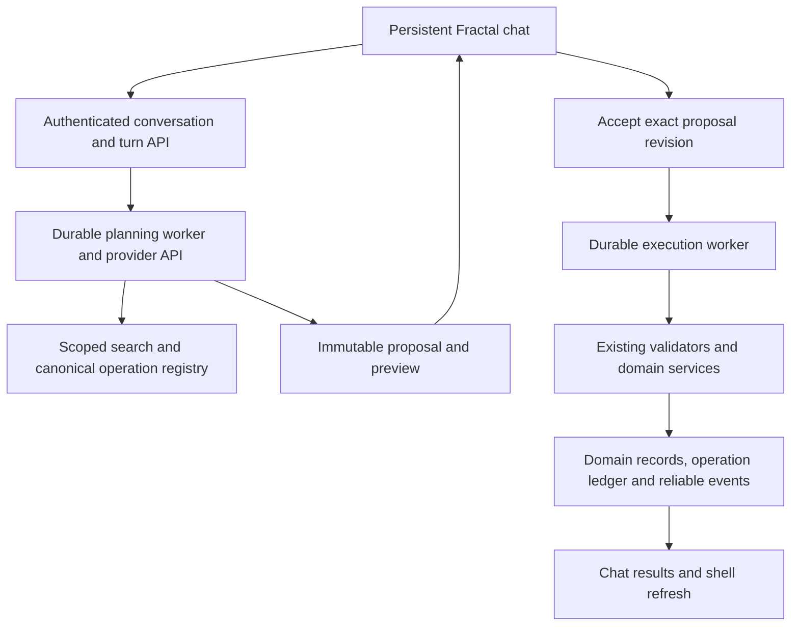

# Embedded AI chat and background execution plan

Status: implementation pass updated September 22, 2026. This supersedes the
connector-first plan. The primary UI is now an embedded persistent chat with background
planning, reviewed previews and explicit acceptance. The prior 6.5/10 audit assessed a
narrower implementation and remains historical. Keep features gated until the checks
below pass.

## Product objective

Users describe work in Fractal's chat window. A fully embedded agent finds relevant
records, asks conversational clarification when needed, prepares changes, and presents
a preview. Only after the user accepts does a background worker apply those exact
operations through existing domain APIs/services.

Remove “Focus this handoff on specific items,” its multi-select controls, and manual
entity-focus selection. The primary flow must not require choosing a connected service,
copying a handoff, or opening ChatGPT/Claude. Context discovery is the agent's job.

Use the existing app-funded provider API backend as the implementation baseline:
server-side credentials, explicit usage disclosure, privacy gates and spending caps.
Consumer subscriptions are not assumed to fund embedded inference. Existing MCP
connections are an optional separate integration; public-host OAuth/MCP verification
is not a dependency of embedded release. Provider API validation remains required.

## User journey

1. Open persistent, non-modal chat from the authenticated app shell. Preserve the
   conversation across navigation/minimizing and restore it after reload.
2. Enter a request such as “Build a four-week program for my running goal, schedule
   three sessions each week with distance and duration metrics, and leave a note.”
3. Capture the current fractal, route/entity and timezone as validated context hints.
   The agent searches additional owned records automatically and shows concise progress.
4. Ask in chat if names, dates, units or targets are ambiguous. Names/links in a
   clarification are useful; a mandatory focus-picker form is not.
5. Show a review card: additions, before/after edits, named associations, dates,
   metric units/values, and downstream completion/progress effects. Actions are
   **Accept and apply**, **Request changes**, and **Reject**.
6. Acceptance queues the exact proposal revision. Show durable progress, results with
   record links, partial failures, and **Cancel remaining work**. Refresh affected pages
   even when chat is minimized. Follow-up requests produce new reviewed proposals.

Planning may continue while the tab is closed. A proposal waiting for acceptance never
writes domain records. Accepted execution may continue without an open tab. This is
request-triggered background work; recurring autonomous schedules are a future scope.

## Required create/update capabilities

Every capability needs scoped retrieval, canonical validation, preview, authorization,
version preconditions, durable execution and affected-query metadata. A route's existence
alone does not establish that the agent supports it.

| Domain | Required behavior | Important distinction |
| --- | --- | --- |
| Goals | Create hierarchy nodes; update supported fields, dates, targets and associations | Preview parent, cascading deadlines and target effects |
| Sessions | Create planned sessions from templates or explicit activities; update details and contents | Scheduling is distinct from recording work and completion |
| Activities | Create/update definitions and goal associations; add/update session instances | Definition-wide edits differ from a single session's edits |
| Metrics | Create/update definitions and units; record/correct explicitly requested activity values and sets | Changing measurement structure differs from changing recorded results |
| Programs | Create/update programs, blocks, days, schedules and template links | Use canonical dates, timezone and occurrence evaluation |
| Notes | Create and update notes/comments on supported goal/session/activity targets | Show the content diff and linked target |
| Templates | Create/update reusable templates needed by session/program requests | Preview reuse versus modification and downstream scope |

Reuse goal/target, session lifecycle/activity, metric/set/progress, activity association,
program/calendar, note and template services. Confirmed HTTP seams include session
POST/PUT and session activity/metric PUT routes in `blueprints/sessions_api.py`,
activity/fractal-metric POST/PUT in `blueprints/activities_api.py`, and note POST/PUT in
`blueprints/notes_api.py`. Inventory exact schemas/service owners before each addition.

Do not infer that planned work was performed. Explicit requests to record results or
complete a session require distinct lifecycle operations with their progress effects in
the preview. This revises the old blanket exclusion of completion evidence: permit it
only through deliberately designed/tested operations, never incidental generic fields.
Standalone manual calendar status overrides and record deletion remain outside this scope.

## Architecture and implementation reuse

Reuse `AgentChatPopover`, proposal review, embedded conversation/execution services,
operation registry and worker infrastructure. Keep HTTP routes thin; new orchestration
endpoints compose canonical services, not Flask view functions or parallel CRUD code.
Never run inference in a database transaction or expose provider credentials to clients.

The model may read and submit proposals but cannot approve them. Generate model-visible
schemas from the canonical registry and expose relevant domains/tools progressively,
so schema overhead does not exhaust the turn. Optional adapters consume that same
contract without participating in the embedded execution path.

## Automatic context instead of manual selection

Bind a conversation to an owned fractal. Route/entity IDs are hints, not permission.
Capture scope per turn so navigation cannot silently retarget background work. Make a
fractal switch explicit in conversation and clear in the preview. Derive identity from
authentication and validate every referenced record, root and relationship.

Provide paged search by name/type/date and lookup by ID for all required domains,
including historical sessions and metric units. Resolve ambiguity conversationally;
resolve newly created entities through proposal dependencies. Preserve tenant isolation
and soft-delete rules in search, history, preview and execution.

Bound bytes and nested records, not just top-level rows. Truncation must provide usable
continuations, and page size one must not return identical retry instructions forever.
Treat notes/retrieved content as data that cannot expand permissions or approve writes.

Remove focus-picker UI, state, styles and tests that exist solely for that form. Retain
useful server-side scope/lookup primitives and replace picker tests with automatic
retrieval, ambiguity and no-selector acceptance tests.

## Preview and acceptance contract

Persist an immutable proposal revision with operations, dependency order, affected
entity names, initial versions, semantic diffs and derived impacts. Group large plans
by domain with counts and expandable details. Preview actual dates/timezones, units,
associations and completion/target effects. Ambiguity blocks readiness for acceptance.

Acceptance binds the exact proposal hash/revision, user, root and expiry. Requesting
changes creates a new revision and invalidates old acceptance. Only authenticated
first-party approval records authorize writes; model claims of approval are insufficient.
Initially accept/reject the complete proposal and request refinements through chat.
Partial acceptance is deferred until dependency-safe selection is designed.

At execution revalidate ownership, quotas, versions and lifecycle rules. External edits
require renewed review; earlier approved operations in the same proposal must not be
mistaken for external changes. Do not use preview-generated timestamps as execution
preconditions. Reject unsupported overlaps before review rather than partially applying
a predictably invalid plan.

Atomicity is per operation unless a composite explicitly shares one transaction. Domain
mutation, operation result, change cursor and durable events commit together. Retries
must not duplicate sessions, metrics, notes or successful earlier steps. Report partial
progress honestly. Undo is a newly reviewed inverse against current versions; disclose
where safe undo is unavailable.

## Background execution and production controls

Separate planning-turn states, proposal states and execution states. Persist queued,
running, awaiting-user and terminal planning states, plus awaiting-review, accepted,
rejected, expired and superseded proposal states. Durable status/results survive worker
restarts, reloads and closed tabs; polling or SSE is merely delivery. Show useful action
summaries rather than private model reasoning.

Reserve realistic provider input/output usage before calls, including schema/context
overhead. Enforce cumulative turn/time/tool limits and daily user/deployment spending
caps, with fenced attempts and persistent usage/checkpoints. Define unknown-outcome
recovery without uncontrolled retries. Bound submission rates, queues/concurrency, and
alert on stuck work and spend. Recheck account eligibility, ownership, provider/write
flags and cancellation at checkpoints.

Embedded-only execution and shell refresh must work with connectors disabled. Cancelling
planning differs from cancelling accepted execution; stopping cannot undo committed
writes. Keep history readable when new work is disabled.

Session/metric support requires a renewed event-consumer audit: target evaluation,
completion cascades and required read-model effects are correctness-critical. Use
transactional handling or durable acknowledgement/retry/deduplication. Durable EventLog
alone does not prove those effects occurred. Verify retention/export/account deletion
for conversation, usage, proposal, result and audit records.

## Delivery plan and S+ acceptance

| Stage | Deliverable | Exit evidence |
| --- | --- | --- |
| E0 — Foundation fixes | A1 sequential-write correctness; R7/A3 realistic budgets; A4 bounded discovery; embedded schema parity | Realistic-input, concurrency, crash/replay regressions and a scoped provider API read/propose smoke test |
| E1 — Embedded vertical slice | Wire shell chat to turn API/worker; remove handoff and focus UI; preview/accept a goal or note change | Browser → API → worker → preview → approval → real domain write, connectors disabled; zero unapproved writes |
| E2 — Required domains | Sessions, metric definitions/values, note/template updates and related lifecycle tools | Create/update cases for every domain and a combined goal/program/session/metric request with correct derived effects |
| E3 — Background and review completeness | Revisions, durable progress, recovery, cancellation, refresh and safe undo | Minimize/navigate/reload/close-reopen; stale review, expiry, overlapping writes, replay and partial-failure tests |
| E4 — Production qualification | Provider evaluation, configuration, accessibility, costs and operations | Actual API evaluations, queue/spend alerts, rollback drill, required repository gates and deployment smoke tests |

Extend `planning/evals/ai-agent-harness-v1.json` with sessions, metric schema versus value
changes, note edits, ambiguous references, contextual discovery, conversational revisions
and full embedded multi-turn workflows. Every domain requires an end-to-end success
case plus important boundaries/failures. Retain the target of at least 95% correct
completion on unambiguous supported tasks over repeated trials per enabled provider;
unauthorized/unapproved writes and duplicate effects must be zero in the fault suite.
These are release targets, not achieved results.

Run repository backend/frontend, coverage, lint, maintainability, dependency, migration,
container/build and browser gates after implementation. Browser tests simulate only
provider responses while using real Flask/workers and domain writes. Separately record
actual provider API smoke/evaluation evidence. Public ChatGPT/Claude OAuth/MCP tests
gate only optional connectors and do not block an otherwise qualified embedded release.

## Latest audit alignment and completion audit

The [latest audit intent addendum](ai-agent-harness-production-review-2026-09-20.md)
reopens embedded UI/refresh acceptance, makes budgets and discovery primary blockers,
and adds session/metric lifecycle and preview requirements. A1's sequential same-entity
failure is fixed with semantic state hashes and optimistic versions, while independent
concurrency and lifecycle effects remain release gates. A2's nullable adapter defect is
fixed locally; external connector parity still needs host verification. A5 evidence gaps
remain open. Earlier test counts are historical, not new-scope acceptance.

The embedded chat, background planning path, immutable preview/acceptance boundary,
automatic context retrieval and canonical session/metric operations are implemented
locally behind deployment flags. S+ still requires E0–E4 evidence, full lifecycle
effects, browser and recovery coverage, measured provider usage, and operational and
deployment qualification. Optional connectors remain a separate release track.

Current local evidence includes 13 embedded worker tests, 9 schema and adapter parity
tests, 32 reviewed harness tests including two approved updates to one goal, 17 session
service tests, frontend agent component tests, lint, production build, maintainability,
responsive checks, backend compilation and a single Alembic head. A full suite, fresh
migration rehearsal, real provider evaluation, browser worker flow and deployment
operations evidence are still required before enabling the flags.

Suggested commit: `docs: prioritize embedded AI chat with reviewed background changes`
