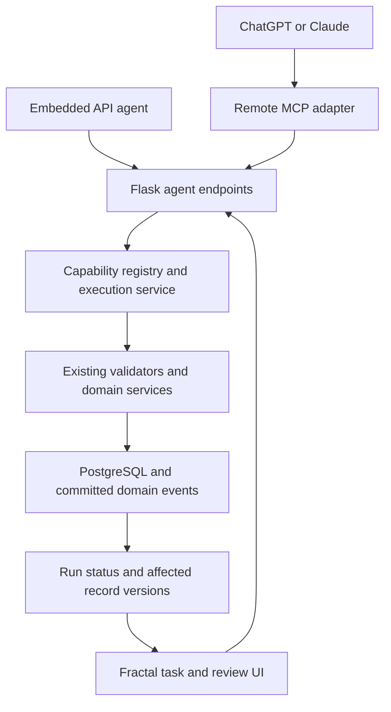

# AI agent integration and execution harness

Status: local implementation includes the delegated harness, reviewed create/update
workflows, and an optional app-funded embedded assistant. Connector and embedded
features remain disabled until their release gates pass. Audit updated September 20,
2026.

## Recommendation and product boundary

Build one Fractal Goals capability and execution layer, exposed through a remote MCP
server to ChatGPT and Claude. Connection management, task briefs, change review,
execution history, and a separately funded embedded assistant now use that shared
layer locally. Hosted provider integrations remain opt-in and gated.

These are distinct experiences:

| Experience | Where reasoning runs | Funding and access | Recommendation |
| --- | --- | --- | --- |
| Connect Fractal Goals to ChatGPT/Claude | In the user's AI product | That product's access rules and usage limits | First release |
| Describe work and review results in Fractal Goals, hand off to connected AI | Brief/review in Fractal; conversation in AI product | Same connector arrangement | First release; explicit handoff |
| Fully embedded chat and background agent | Provider API called by our backend | App-funded API usage; subscription portability is not assumed | Implemented locally; gated release |

OAuth here means the AI product signs into **Fractal Goals** with the user's consent.
It does not mean our backend receives a general right to spend their AI subscription.
Anthropic explicitly requires prior approval for third-party products to offer
claude.ai login or rate limits through the Agent SDK. Its remote connectors provide
the appropriate user-product integration. [Claude Agent SDK](https://code.claude.com/docs/en/agent-sdk/overview),
[Claude custom connectors](https://support.claude.com/en/articles/11175166-get-started-with-custom-connectors-using-remote-mcp).

OpenAI's current ChatGPT plugin documentation supports MCP over Streamable HTTP at
`/mcp`, account authorization with resource-bound OAuth tokens, and optional UI.
Developer-mode access depends on account/workspace policy. Public plugin submission
requires a stable public HTTPS endpoint; a private development tunnel does not replace
that submission endpoint. Use MCP Inspector before connecting the target ChatGPT
account, then verify the OAuth client registration method, token audience, tool
annotations, confirmation behavior, and account policy in the compatibility spike.
Do not promise availability to every subscriber. [OpenAI authentication guide](https://developers.openai.com/plugins/build/auth),
[ChatGPT connection and testing guide](https://developers.openai.com/plugins/deploy/connect-chatgpt),
[MCP server guide](https://developers.openai.com/plugins/build/mcp-server).

Anthropic's current custom-connector guide documents Streamable HTTP, OAuth dynamic
client registration, and token refresh for remote MCP servers. It also limits connector
availability by Claude plan and, for work accounts, organization role. This matches the
adapter's selected transport and grant features at the documentation level only; verify
the account entitlement, DCR client settings, expiry/refresh, and confirmation UX in a
real Claude account before release. [Anthropic remote MCP connector guide](https://support.anthropic.com/en/articles/11503834-building-custom-integrations-via-remote-mcp-servers).

Do not collect consumer session cookies, copy CLI OAuth tokens to the server, or
market an unverified subscription-to-API bridge. A local companion is a separate
product investigation, not a dependency of this design.

## Implementation audit

The shared local harness and first-party review surface now exist. This is an
implementation audit, not a production certification; remote host interoperability
has not been exercised.

- Flask owns Authlib authorization code + PKCE, dynamic client registration, resource
  metadata, delegated scopes/root grants, short-lived internal credentials, refresh
  rotation/replay revocation, connection revocation, task/proposal/run APIs, and the
  independent execution authorization checks. The MCP adapter has no database access.
- The operation ledger, proposal hash/approval binding, leases, idempotent operation
  results, cancellation, per-operation transaction/event handling, retention, export,
  and account deletion integration are implemented. Goal, activity, note, template,
  program, block, reusable program-day definition, and scheduled session occurrence
  creation use canonical services.
- Reviewed updates cover goal, activity, program, block, and program-day fields, plus
  activity-to-goal association changes. Preview records before/after values and binds
  an entity-and-relationship snapshot into the proposal; execution rejects stale
  snapshots. Undo creates a fresh approval proposal and is offered only for reversible
  field changes. Goal target changes, cascading child deadlines, and activity metric or
  split history are explicitly rejected for undo rather than guessed.
- Temporary operation references support dependent creates in a single proposal.
  Proposal validation runs the canonical services inside a rollback-only savepoint.
  Program context queries apply per-parent limits in the database.
- Settings, task handoff, entity context selection, review/history, cancellation, and
  affected-record navigation are wired through shared TanStack Query keys.
- The embedded API supports OpenAI and Anthropic server-side keys, bounded context and
  proposal tools, persisted provider checkpoints, step/token/time limits, cancellation,
  and in-app conversation history. Its proposals still require the same first-party
  approval and execution path. `ai_agent_embedded` defaults off and an explicit
  deployment privacy/terms approval switch must also be enabled.
- `ai_agent_connectors`, `ai_agent_writes`, `ai_agent_embedded`,
  `ai_agent_embedded_openai`, and `ai_agent_embedded_anthropic` default to disabled.
  Embedded providers require both their individual switch and the umbrella/privacy
  gates. Disabling a provider cancels queued turns and signals active turns to stop at
  the next checkpoint while preserving history. A configured public MCP endpoint,
  target ChatGPT/Claude accounts, and deployment credentials are not available here,
  so Stage 0 and Stage 3 host evidence remain open.
- Provider SDK dependency pins are resolver-compatible (`typing_extensions==4.16.0`,
  `idna==3.18`); the application, MCP adapter, and frontend production dependency audits
  pass with no known vulnerabilities.
- The pinned `Authlib==1.8.0` dependency is installed in the local virtual environment.
  The PostgreSQL-backed backend suite passes (1,000 tests) at 80.88% coverage, above the
  80% repository gate. The 19 harness tests
  cover concurrent apply, grant revocation during execution, approval mutation,
  pre/post-commit crashes, expired-lease recovery, partial progress, quotas, deleted
  parents, invalid goal types, duplicate dates, and missing templates. Seven strict
  schema cases reject extra fields across create and schedule operations. All 1,209
  frontend tests pass and its coverage thresholds pass (66.5% lines). Frontend lint,
  production build, responsive and maintainability checks pass; the desktop/mobile
  browser workflows pass (4 tests). Backend maintainability and Python compilation
  pass. On a fresh temporary PostgreSQL database, Alembic upgrade, schema check,
  downgrade, re-upgrade, and schema check all pass.
- The seven-case MCP adapter suite covers transport, the OAuth resource-metadata
  challenge and bearer authentication, schemas, safety annotations, and prompt-boundary
  behavior. The complete suite passes inside the
  production image with the pinned SDK, including a real Streamable HTTP
  initialize/list/call round-trip, delegated-token verification, token exchange, and a
  scoped backend tool call. Both production images build locally; image dependency
  checks pass, and the adapter imports from its image. CI runs adapter tests against the
  pinned SDK and builds/import-checks both images.

Deliberate boundaries: proposal writes do not delete records, mark goals complete, or
change manual calendar statuses or session completion evidence. Undo is a separate
reviewed inverse proposal and is limited to supported reversible updates.

Distance to S+ production quality: Stage 0 needs a public endpoint and OAuth/MCP
verification in both target products. Stage 3 needs MCP Inspector, reconnect/revoke,
rollback, privacy/distribution, and mobile/keyboard checks. Embedded release also needs
approved provider terms/privacy, deployment keys/models, provider smoke tests, and
production cost and abuse monitoring.

## User experience

1. Settings → AI connections: select ChatGPT or Claude, connect the Fractal account,
   choose allowed fractals and read/write permissions, and see connection status/revoke.
2. A goal/program action opens “Ask AI” with the current entity already selected.
   Example: “Create six practice activities for this goal and schedule three days
   a week for four weeks, starting next Monday. Leave a note explaining the plan.”
3. Save an authenticated task brief containing the request, entity IDs, timezone,
   and optional limits. Supply a copyable handoff instruction with its opaque ID.
   Open the provider using a documented link if supported; otherwise use copy/open
   guidance. Do not assume arbitrary prompts can be injected into provider chats.
4. The external agent reads the brief and scoped context, resolves ambiguity, and
   submits a structured proposal. Preview shows additions, edits, dates, associations,
   and notes using real app names. Missing dates/templates/parents become questions.
5. User approves the proposal in Fractal Goals. Execute its exact stored operations;
   show progress, affected-record links, errors, and any remaining work.
6. A later opt-in “Allow routine changes” policy can authorize bounded operations
   within selected roots and limits without repeated app approvals. Provider-host
   confirmations may still apply. Larger edits and destructive actions require review.

The connector flow includes in-app intent capture and review, with reasoning performed
after an explicit provider handoff. The embedded flow provides in-app reasoning through
the configured provider API once its feature, privacy, and deployment gates are met.

## Architecture and ownership

The MCP adapter calls authenticated Fractal HTTP endpoints. Existing single-operation
routes remain reusable; new proposal/run endpoints compose the same services where
durability or batching requires it. Never call Flask view functions internally or
reimplement goal/program rules in the MCP process. Any route-only rules required by
both paths move into their canonical validator/service as part of the change.

Use an official maintained MCP SDK in a small separately deployed adapter, keeping
Flask and SQLAlchemy as the domain runtime. Choose Python if its tested client/protocol
support meets the spike; otherwise use the official TypeScript SDK for this transport
boundary. It receives no database credentials and cannot call arbitrary URLs.

Use public HTTPS Streamable HTTP, strict tool schemas and structured results. Pin
SDK/protocol versions to a tested ChatGPT/Claude compatibility matrix. The current MCP
transport documentation resolves to 2026-07-28; verify client support before adopting
new protocol behavior, retaining only compatibility paths the matrix requires.
[MCP transport specification](https://modelcontextprotocol.io/specification/2026-07-28/basic/transports).

## Initial tools and API mapping

Paths below include the `/api` prefix. Expose a curated capability set, not every route.

| Capability | Existing route/service reuse |
| --- | --- |
| Read scoped context | `GET /api/<root_id>/goals`, goals detail, activities, programs, templates; compose bounded summaries |
| Create/update goals | `POST /api/<root_id>/goals`; `PUT /api/<root_id>/goals/<goal_id>` |
| Create/update activities and associate goals | `POST`/`PUT /api/<root_id>/activities`; `POST /api/<root_id>/activities/<activity_id>/goals` |
| Create/update program structure | Existing program, block, and block-day POST/PUT routes in `blueprints/programs_api.py` |
| Schedule day occurrences | Existing block-day `/schedule` operation; use canonical calendar evaluator for preview |
| Leave comments | `POST /api/<root_id>/notes`; preserve existing supported note targets |
| Reuse/build session templates | Existing template API and service; add to the initial capability inventory during spike |
| Preview/apply/read task | New agent task/proposal/run endpoints, composing the above domain operations |

Suggested MCP tools: `list_fractals`, `get_task`, `get_goal_context`,
`list_activities`, `get_program_context`, `list_templates`, `propose_changes`,
`get_proposal`, `apply_proposal`, `get_run`. Proposal operations use a discriminated,
allowlisted schema: `create_goal`, `update_goal`, `create_activity`, `update_activity`,
`associate_activity_goals`, `create_template`, `create_program`, `update_program`,
`create_block`, `update_block`, `create_program_day`, `update_program_day`,
`schedule_program_day`, `create_note`.

Each enabled operation defines its required scope, validator, handler, preview,
output, and affected query roots. Scheduling an existing program day binds a hash of
its source state; all writes revalidate ownership and canonical service constraints
when executed. Temporary proposal references resolve newly created parents/templates
before dependents execute. Return IDs, links, pagination/truncation indicators, and
typed recoverable errors.
Start with a proposed maximum of 50 operations per proposal and bounded context
pages; measure and tune these limits in the spike. No arbitrary SQL, shell, HTTP,
or browser-driving tool is needed.

Activity definitions are planned work, not completed activity instances. Program-day
creation must not invent completed sessions. Goal completion and manual calendar
statuses are separate capabilities deferred until explicitly designed. Notes remain
notes; add agent/run provenance without inventing a competing comment table.

The local allowlist includes goal and activity updates, activity-to-goal association
changes, program/block/program-day updates, and the original create/schedule/note
operations. Existing manual calendar statuses, completed sessions, and record deletion
remain outside the agent capability set.

## Delegated access

Use an established OAuth authorization-server implementation with existing Fractal
login as the consent identity. Implement authorization code + PKCE S256, protected
resource metadata, issuer discovery, strict redirect validation, audience validation,
short-lived access tokens, refresh rotation where supported, and revocation.
Prefer Client ID Metadata Documents where supported; pre-registration or DCR are
compatibility choices verified against each host. Validate metadata fetching against
SSRF and unsafe redirects. [MCP authorization](https://modelcontextprotocol.io/specification/latest/basic/authorization),
[OpenAI authentication](https://developers.openai.com/plugins/build/auth).

Persist grants mapping `(user, client, allowed_roots, scopes, expiry, revoked_at)`.
Use domain scopes such as `goals:read`, `goals:write`, `activities:write`,
`programs:write`, and `notes:write`. Derive the actor from validated credentials;
tool arguments never supply authoritative user IDs. Check every referenced entity,
root, soft-delete status, quota, and current grant at read and execution time.

The MCP token's audience is the MCP server. Do not blindly forward it to an API
with a different audience or substitute a full-power app JWT. Establish a supported
token exchange issuing a short-lived internal API credential with the same or
narrower user/root/scopes, bound to the adapter. The Flask execution boundary checks
that delegated principal independently. Treat this as a spike acceptance gate.

Approval is bound to the immutable proposal hash/version, actor, root, and expiry.
`apply_proposal` can consume valid approval but cannot manufacture it. In default
review mode only the authenticated first-party UI can approve. Model statements
such as “the user approved” are not authorization evidence. Scope upgrades and
revocation work server-side even if the host caches tools or tokens.

## Reliable execution and review

Persist task briefs, immutable proposal revisions, approval records, runs, and
operations. Keep provider connection metadata separate from domain records.
An external conversation ID is optional metadata, not a trusted execution identity.

Run states: `queued → running → succeeded | partially_succeeded | failed | cancelled`;
proposals independently track `draft → awaiting_approval → approved | rejected | expired`.
Cancellation stops subsequent operations; it cannot reverse an already committed write.

- Preview performs real schema/ownership/reference validation and evaluates dates in
  the user's IANA timezone; execution revalidates against current state.
- Use integer row versions or reliable ETags for mutations and relationship sets.
  Reject stale edits with a conflict and require a new preview rather than overwrite.
- Stable `(grant/user, proposal revision, operation ID)` idempotency plus an input hash
  prevents replay. Reject reuse with different input. Store the operation result and
  domain mutation in the same database transaction.
- Refactor only participating services to accept an explicit unit of work while
  preserving their current default single-call commit behavior. Avoid a ledger write
  after a separately committed domain mutation: that leaves a crash duplication window.
- Start with atomicity per operation and durable ordered partial progress for the
  complete proposal. Stop dependent operations after failure; expose actual successful
  IDs. Do not advertise atomic batches until a shared transaction actually supports them.
- A worker claims operations with leases and fencing, records durable results, and
  resumes after restart. Transactional event/outbox handling prevents premature events.
  Bounded retries apply only to transient failures; ambiguous timeouts consult the ledger.
- Undo is a new reviewed inverse proposal with current-version/dependency checks.
  Do not silently delete records that have since accumulated user work.

Store action summaries, before/after diffs, actor/provider/grant IDs and trace IDs.
Do not log credentials or private model reasoning. Set retention/export/deletion rules
for briefs, diffs, and run records using the existing account lifecycle.

Read user notes as untrusted content; they cannot expand permissions or become system
instructions. Minimize provider-visible data and exclude unrelated roots by construction.

## Client integration and embedded phase

Connection settings, the task drawer, proposal diff/review, and run history are
implemented. Keep state in TanStack Query with shared agent query keys. Poll active
tasks/runs with bounded backoff and refresh on focus; also poll a scoped change cursor
while relevant screens are active so provider-originated runs appear without a locally
started task.
Committed results identify affected entity/query roots for narrow invalidation.
SSE can replace active polling later without changing the durable status contract.

The embedded path uses pinned official provider clients, a bounded tool loop, provider
checkpoints, cancellation, and concurrent-run limits. API keys remain server-side,
provider billing is disclosed, and inference runs outside database transactions. The
privacy approval switch remains off until deployment review. A managed agent runtime
is optional after comparing cost and operational fit; API MCP support can reuse the
connector surface where appropriate. [OpenAI API MCP tools](https://developers.openai.com/api/docs/guides/tools-connectors-mcp).

## Delivery plan and S+ acceptance gates

| Stage | Deliverable | Current state and remaining evidence |
| --- | --- | --- |
| 0. Compatibility spike | Disposable public MCP endpoint, OAuth/exchange proof, one scoped read and reviewed note write in both hosts | Not run: public endpoint and target-product accounts are unavailable. Use MCP Inspector, then perform real target-account OAuth registration, audience/resource, token expiry/refresh, reconnect/revoke, tool annotation/confirmation, and protocol-matrix checks without production data. Anthropic documents Streamable HTTP, DCR, and refresh; verify account entitlement and actual host behavior. |
| 1. Shared foundation | Delegated grants, capability schemas, task/proposal/run models, operation unit of work | Implemented and locally verified. The full PostgreSQL suite, including recovery/fault tests and independent embedded-provider switches, passes above the 80% gate; fresh-database migration upgrade/check/downgrade/re-upgrade/check passes. |
| 2. Reviewed workflows | Create/schedule, reviewed updates, independent associations, safe undo, task/review/history UI | Implemented and locally verified. Backend coverage gate, all 1,207 frontend tests and frontend coverage thresholds pass. |
| 3. Connector release | Host packaging, onboarding, capability descriptions, feature-flag rollout | Adapter protocol, unauthenticated OAuth challenge, delegated auth/exchange, scoped tool calls, and host-facing tool annotations pass against the pinned SDK in a local Streamable HTTP round-trip; its production image builds and imports, and flags are off. Deployment, MCP Inspector, real ChatGPT/Claude smoke tests, privacy/distribution review, accessibility checks, and rollback drill remain. |
| 4. Embedded assistant | In-app conversational loop and explicit API billing | Implemented locally behind the feature and privacy gates. Provider keys/models, privacy/terms approval, provider smoke tests, production cost monitoring, and operational review remain. |

Acceptance suite includes cross-tenant nested IDs, revoked grants during a run,
duplicate apply and concurrent delivery, crash immediately before/after commit,
changed proposal after approval, concurrent manual edits, quota exhaustion, soft-deleted
parents, invalid goal levels, repeated dates, DST boundaries, overlapping program days,
missing templates, malicious note instructions, and partial dependency failure.

The deterministic local suite covers cross-tenant nested IDs, concurrent duplicate
apply, revoked grants during a run, pre/post-commit crashes, restart recovery,
changed proposals after approval, concurrent manual edits, quota exhaustion,
soft-deleted parents, invalid goal levels, repeated dates, missing templates, and
partial dependency failure. Existing calendar tests cover DST boundaries and
overlapping program days. Adapter prompt-boundary tests assert that notes and briefs
stay untrusted and that `apply_proposal` never approves. The versioned evaluation set
at `planning/evals/ai-agent-harness-v1.json` covers all
four requested workflows, ambiguity, unsupported actions, injection resistance, and
follow-ups. It is authored but has not been run against providers. Proposed launch
threshold: at least 95% correct
completion on unambiguous supported tasks across repeated trials per host, and zero
unauthorized writes or duplicate effects in the deterministic fault suite. Treat these
as release targets, not measured results. Record latency/tool counts and set budgets
from the spike; rerun evaluations after schema, prompt, SDK or provider changes.

Run the repository's required backend/frontend, coverage, lint, maintainability,
migration, dependency, production-build and browser gates for implementation. Verify
keyboard/mobile review, loading/error states, external-change refresh, multi-worker
restart, and revocation manually where host behavior cannot be automated.

Use a separate feature flag for each app-funded API provider, with the existing shared
connector switch and write-capability switch. A write kill switch stops new operations
without hiding history. Roll back application capabilities without destructive schema
rollback. Remove experimental adapters and duplicate mutation/validation logic as the
shared layer becomes canonical; unrelated cleanup stays out of scope.

## Completion audit

The local implementation covers the shared OAuth/API boundary, adapter, durable
reviewed create/update/association workflows, safe undo, embedded API turns, first-party
UI, feature flags, evaluation cases, and account data lifecycle. The PostgreSQL-backed
backend suite passes 1,000 tests at 80.88% coverage; all 1,209 frontend tests pass at
66.5% line coverage. The seven-test MCP adapter suite
covers safety annotations and protocol behavior against the pinned SDK.
Frontend lint, production build, responsive/browser checks, frontend/backend
maintainability checks, Python compilation, and `git diff --check` pass. Both
production images build locally and pass dependency checks; the adapter imports from
its image. Fresh-database Alembic upgrade, schema check, downgrade, re-upgrade, and
schema check pass. Application and MCP adapter dependency audits and the frontend
production dependency audit report no known vulnerabilities. The local evaluation
cases are not measured provider results.

Production release is not complete until the Stage 0 and Stage 3 public-host evidence
above is collected and the evaluation set is run against configured providers. The
public endpoint, target-product accounts, deployment credentials, provider approvals/keys,
and production monitoring are unavailable locally. Embedded release requires the
provider, privacy, cost-monitoring, and operational evidence listed above.

Suggested commit: `feat: complete reviewed AI agent harness and embedded assistant`
